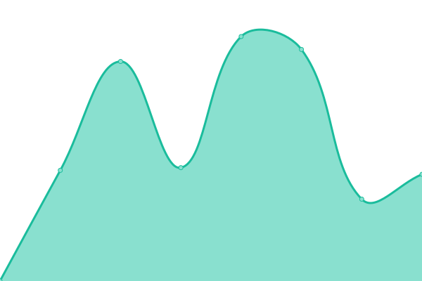

# [📈 Live Status](https://dacot-uoct.github.io/upptime): <!--live status--> **🟧 Partial outage**

This repository contains the open-source uptime monitor and status page for [dacot-uoct](https://dacot-uoct.github.io/upptime), powered by [Upptime](https://github.com/upptime/upptime).

With [Upptime](https://upptime.js.org), you can get your own unlimited and free uptime monitor and status page, powered entirely by a GitHub repository. We use [Issues](https://github.com/dacot-uoct/upptime/issues) as incident reports, [Actions](https://github.com/dacot-uoct/upptime/actions) as uptime monitors, and [Pages](https://dacot-uoct.github.io/upptime) for the status page.

<!--start: status pages-->
<!-- This summary is generated by Upptime (https://github.com/upptime/upptime) -->
<!-- Do not edit this manually, your changes will be overwritten -->
<!-- prettier-ignore -->
| URL | Status | History | Response Time | Uptime |
| --- | ------ | ------- | ------------- | ------ |
|  [Ambiente Desarrollo](https://dacot.duckdns.org) | 🟩 Up | [ambiente-desarrollo.yml](https://github.com/DACoT-UOCT/uptime/commits/HEAD/history/ambiente-desarrollo.yml) | 

 461ms
     
 | 

<a href="https://dacot-uoct.github.io/uptime/history/ambiente-desarrollo">99.21%</a>
    

|  [Ambiente Producción](https://dacot.uoct.cl) | 🟥 Down | [ambiente-produccion.yml](https://github.com/DACoT-UOCT/uptime/commits/HEAD/history/ambiente-produccion.yml) | 

 0ms
     
 | 

<a href="https://dacot-uoct.github.io/uptime/history/ambiente-produccion">0.00%</a>
    

|  [Web Institucional UOCT](https://www.transporteinforma.cl/) | 🟩 Up | [web-institucional-uoct.yml](https://github.com/DACoT-UOCT/uptime/commits/HEAD/history/web-institucional-uoct.yml) | 

 4420ms
     
 | 

<a href="https://dacot-uoct.github.io/uptime/history/web-institucional-uoct">100.00%</a>
    

|  [Web UOCT - Feria de Software 2020](https://dacot.feriadesoftware.cl) | 🟩 Up | [web-uoct-feria-de-software-2020.yml](https://github.com/DACoT-UOCT/uptime/commits/HEAD/history/web-uoct-feria-de-software-2020.yml) | 

 1612ms
     
 | 

<a href="https://dacot-uoct.github.io/uptime/history/web-uoct-feria-de-software-2020">100.00%</a>
    

|  [Benchmark Google](https://www.google.cl) | 🟩 Up | [benchmark-google.yml](https://github.com/DACoT-UOCT/uptime/commits/HEAD/history/benchmark-google.yml) | 

 150ms
     
 | 

<a href="https://dacot-uoct.github.io/uptime/history/benchmark-google">100.00%</a>
    

<!--end: status pages-->

[**Visit our status website →**](https://dacot-uoct.github.io/upptime)

## 📄 License

- Powered by: [Upptime](https://github.com/upptime/upptime)
- Code: [MIT](./LICENSE) © [dacot-uoct](https://dacot-uoct.github.io/upptime)
- Data in the `./history` directory: [Open Database License](https://opendatacommons.org/licenses/odbl/1-0/)
